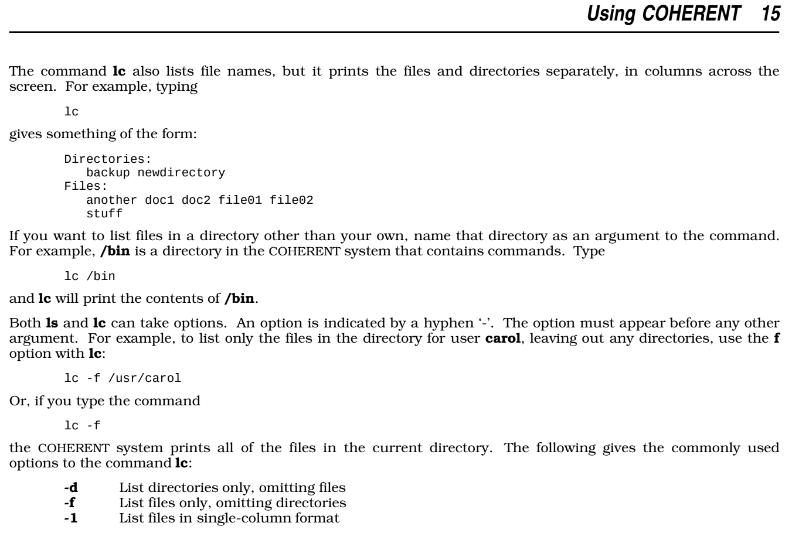

# lc-go

**lc-go** is a Go port of [gdm85/lc](https://github.com/gdm85/lc).
lc(1) is a command similar to ls(1) included with the [Coherent](https://en.wikipedia.org/wiki/Coherent_(operating_system)) Unix clone.

## Installation

```shell
go install dbohdan.com/lc-go@latest
```

You may wish to rename `~/go/bin/lc-go` to `~/go/bin/lc`.

## Manual

The original manual page, lightly edited and converted to use modern `-man` macros, is in the file [`doc/lc.man`](doc/lc.man).
On a modern Linux system, it may be viewed with `man ./lc.man`.
The original, unaltered manual page source is in [`doc/lc.orig.troff`](doc/lc.orig.troff).

A scanned manual page may be viewed below:


## Differences from the C version

- lc-go does not derefence symlinks like gdm85/lc (commit `f6e696ef0e`).

## License

Released under the original [license](LICENSE.md).
